**Room Link**: https://tryhackme.com/room/skynet  
**Difficulty**: Easy  
**Platform**: Linux  
**Author**: Ry@n  

---
## Overview

A vulnerable Terminator themed Linux machine.

---
# Task 1: Deploy and compromise the vulnerable machine!

- OK First thing RECON:
- Im gonna use nmap to do active recon to get some information:
	- `nmap 10.201.70.238 -A -T 4`

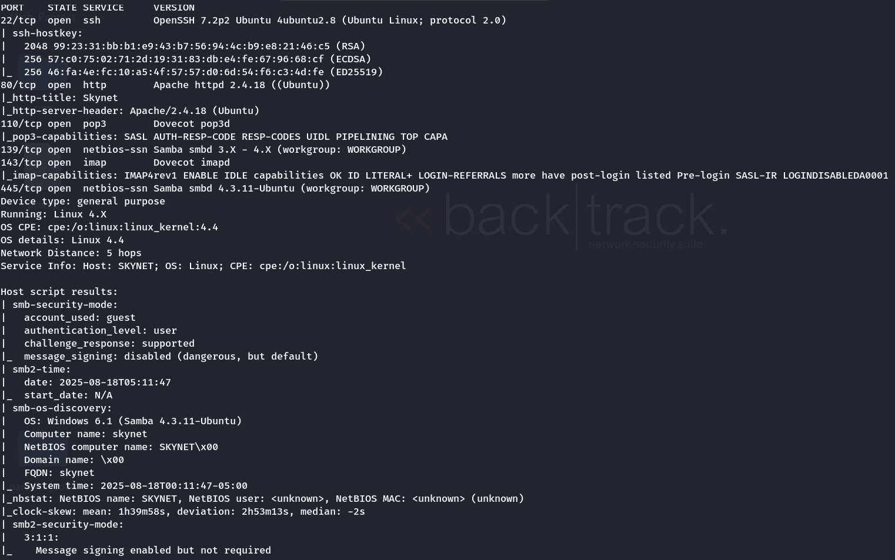

- I saw that they are using samba so let try to find a vuln in that version  

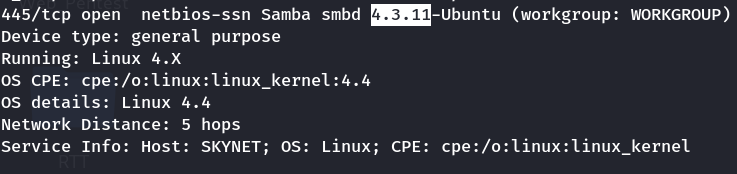

- Now i will use smbmap to enumerate  

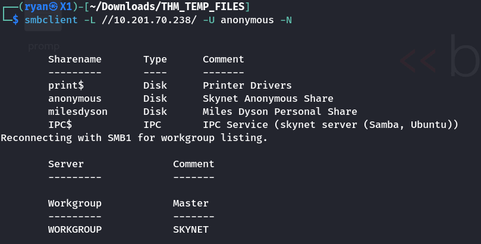

- now let try to access anonymous on smbclient  

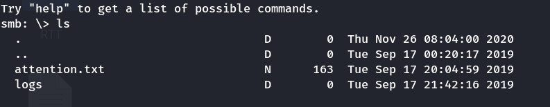

- after we grab all the files we got a file call log1.txt that have something look like a list of password  

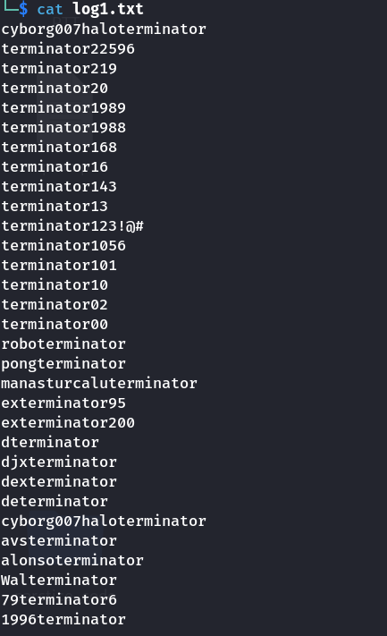

- now let find a way to test is this list have anything usefull  

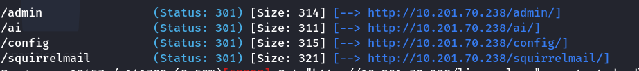

- After a while i found that they have a mail server so let try to login using the log  

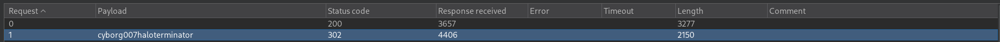

- bingo we now can log into the mail server using milesdyson:cyborg007haloterminator  

## 1.What is Miles password for his emails?  
- Answer: `cyborg007haloterminator`

- After read his mail i found this  

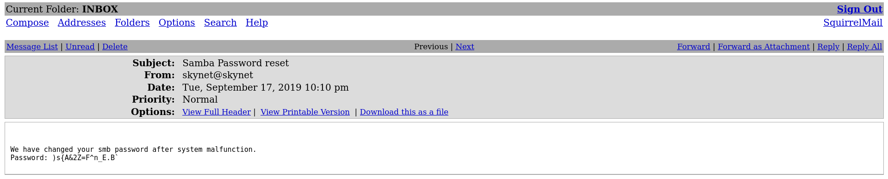

- now we can access his smb folder  

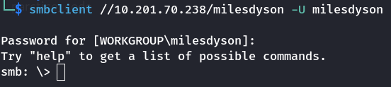

- i found this file look interesting so i download it   

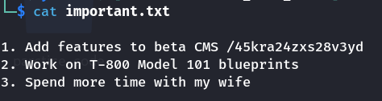

- Ohh i think we just found the hidden directory  

## 2.What is the hidden directory?  
- Answer: `/45kra24zxs28v3yd`

- Hmm it look like we dont have anything to do, let try enumerate the hidden directory
- We found a /administrator page  

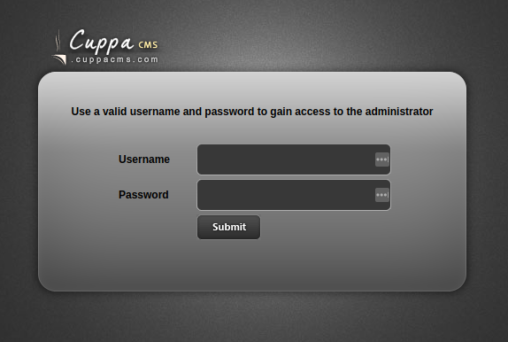

- now let try get access to this machine  

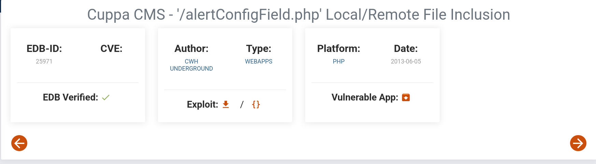

- found it, now let put our payload it to it
- i will use a php reverse payload,python simple server and metasploit handler   

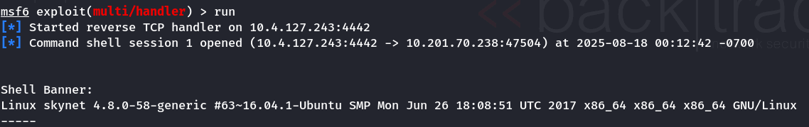  
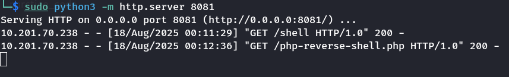

- now we got a RCE, let try to find the user name root flag  

## 3. What is the user flag?  
- Answer: `7ce5c2109a40f958099283600a9ae807`  

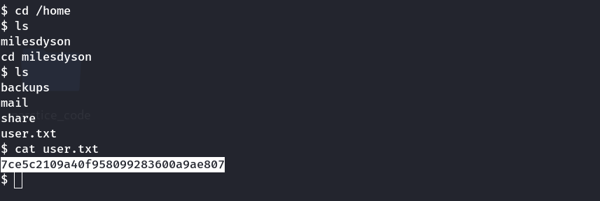

- now let try to get root access
	- decided to go the sudoers route. I ran "shell" to drop into a normal shell and ran the following to have a proper tty terminals session.
	
	`python -c 'import pty;pty.spawn("/bin/bash")';`
	- I moved to /var/www/html (which is the directory being tar'd) and ran the following.  
	`echo 'echo "www-data ALL=(root) NOPASSWD: ALL" > /etc/sudoers' > privesc.sh`  
	`echo "/var/www/html"  > "--checkpoint-action=exec=sh privesc.sh"`  
	`echo "/var/www/html"  > --checkpoint=1`  
	- After short while I ran "sudo -l" with the following results.
	- User www-data may run the following commands on skynet:
	    (root) NOPASSWD: ALL
	- I am now able to run "sudo cat /root/root.txt"   

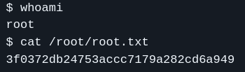

## 4.What is the root flag?  
- Answer: `3f0372db24753accc7179a282cd6a949`

